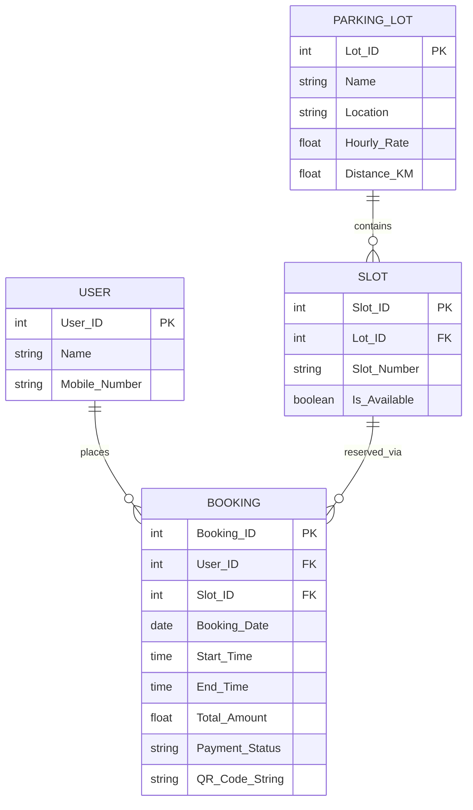

# QUICKSLOT - Smart Car Parking System

## Project Description

QUICKSLOT is a smart car parking pre-booking web application designed to help users find and reserve parking slots in advance. The system allows users to search nearby parking lots, view parking prices and distance, select a suitable time slot, make a simulated payment, and receive a digital parking ticket with a QR code.

This project helps reduce urban parking problems such as traffic congestion, time wastage while searching for parking, and manual ticket handling.

---

## Aim of the Project

The aim of QUICKSLOT is to provide an efficient and user-friendly parking reservation platform where users can pre-book parking spaces before reaching their destination.

The system also helps parking operators manage parking slots digitally and efficiently.

---

## Features

- User login using name and mobile number
- Search nearby parking lots
- View parking lot distance and hourly pricing
- Select booking date, start time, and duration
- Reserve available parking slots
- Automatic total amount calculation
- Digital ticket generation
- QR code generation for validation
- Separate upcoming and past bookings
- Relational database structure to prevent double booking

---

## Tech Stack Used

| Technology | Purpose |
|---|---|
| React | Frontend Development |
| Supabase | Backend Services |
| PostgreSQL | Database |
| Mermaid.js | ER Diagram Rendering |
| CSS | Styling |

---

# Database Tables

## 1. USER

Stores user details.

| Field | Type | Key |
|---|---|---|
| User_ID | int | Primary Key |
| Name | string |  |
| Mobile_Number | string |  |

---

## 2. PARKING_LOT

Stores parking location information.

| Field | Type | Key |
|---|---|---|
| Lot_ID | int | Primary Key |
| Name | string |  |
| Location | string |  |
| Hourly_Rate | float |  |
| Distance_KM | float |  |

---

## 3. SLOT

Stores individual parking slot details.

| Field | Type | Key |
|---|---|---|
| Slot_ID | int | Primary Key |
| Lot_ID | int | Foreign Key |
| Slot_Number | string |  |
| Is_Available | boolean |  |

---

## 4. BOOKING

Stores booking and digital ticket details.

| Field | Type | Key |
|---|---|---|
| Booking_ID | int | Primary Key |
| User_ID | int | Foreign Key |
| Slot_ID | int | Foreign Key |
| Booking_Date | date |  |
| Start_Time | time |  |
| End_Time | time |  |
| Total_Amount | float |  |
| Payment_Status | string |  |
| QR_Code_String | string |  |

---

# Keys Used

## Primary Keys

- USER.User_ID
- PARKING_LOT.Lot_ID
- SLOT.Slot_ID
- BOOKING.Booking_ID

## Foreign Keys

- BOOKING.User_ID references USER.User_ID
- BOOKING.Slot_ID references SLOT.Slot_ID
- SLOT.Lot_ID references PARKING_LOT.Lot_ID

---

# Relationships

- One user can place multiple bookings.
- One parking lot contains multiple parking slots.
- One slot can have multiple bookings across different dates and times.
- Each booking belongs to one user and one slot.

---

# ER Diagram

---

# Conclusion

QUICKSLOT is a smart parking management system that simplifies parking reservation through slot pre-booking, digital ticket generation, QR validation, and efficient relational database management.

The system improves parking convenience for users while helping parking operators manage parking spaces more effectively.